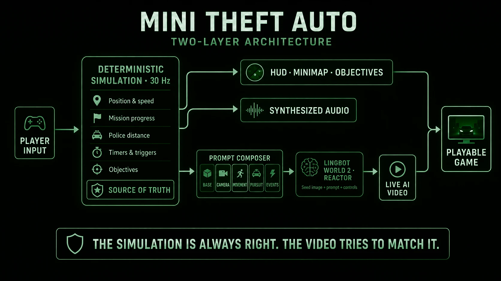
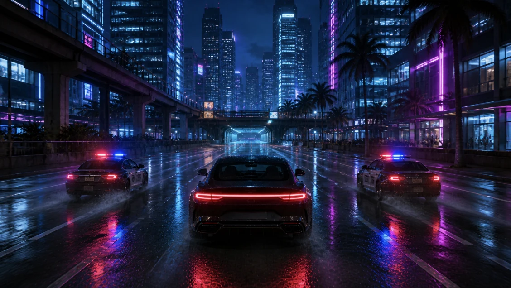

# Can You Make an Open World Adventure Game Like GTA Without a Game Engine?

*A playable experiment combining a deterministic simulation with real-time generative video.*

Can you make an open world adventure game like GTA without using a game engine?

The short answer is: not yet, but quite possibly very soon.

Here is a demo of a game built using a real-time generative video model called Lingobot World 2.0 and LTX 2.0.

[Watch the video demo](./assets/videos/open-world-adventure-demo.mp4)

Lingobot World 2.0 generated the gameplay scenes, and LTX 2.0 generated the real-time speaking avatar.

## How It Works

A deterministic simulation at 30Hz tracks position, speed, mission progress, police distance, timers, and objectives. That's the actual game. Separately, an AI video model receives text descriptions and camera controls, and generates what things look like. That's the rendering layer.

The simulation is always right. The video tries to match it.

## How Reactor Powers the Experience

Reactor is the infrastructure layer connecting the game to both AI video models. When a player starts the mission, the server exchanges its private Reactor API key for a short-lived session token, allowing the browser to connect securely without exposing the key.

Through Reactor's JavaScript SDK, the game opens a LingBot World 2 session, uploads the current scene's seed image, sends its initial prompt, and starts generation. Reactor then streams the generated video directly into the game. As the simulation changes, the same session receives updated prompts and camera controls, keeping the visuals aligned with the player's movement, location, and mission state.

Reactor also provides the connection to LTX 2 for the speaking-character sequences. The game manages both models through a shared workflow: connect, wait for the model to become ready, send the required inputs, and receive video and audio streams. When the mission moves to a new visual segment—or generation drifts too far—the game resets the Reactor session, loads a new seed image, and begins again from a clean context.

Events don't happen because the AI "decided" to show them. They happen because the simulation clock or a distance trigger says so. The HUD, the minimap, the objective arrow, the audio, and the dialogue all read from the simulation. So even when the generated video drifts or glitches, the game stays coherent.

Thirty times per second, the game reads your keys, updates the simulation, checks mission rules, and composes new instructions for the model. It never sends raw key presses and hopes for the best. Instead, it translates simulation state into layered prompts: a base layer for scene identity, a camera layer, a movement layer, a pursuit layer, and an event layer. These get composed, trimmed to stay under the model's character limit, and deduplicated so identical prompts never get sent twice.

The mission is broken into visual segments, each with its own seed image and prompt set. When you move between locations, the game resets the video session entirely behind a full-screen transition still. The player sees a cinematic cut. The model gets a clean slate.

## Interactive Dialogue with a Second AI Model

The mission opens with an interactive dialogue scene before any live generation begins. A character named Mara appears on screen, asks the player a question, and the player picks one of two responses. The dialogue clips are pre-generated by a separate AI video model (LTX), and the player's choice feeds into the game state, shaping the tone of the mission.

The trick is the handoff between the two models. While the 10-second dialogue plays out, the game is staging the first LingBot scene in the background. By the time the player finishes talking to Mara, the live-generated world is already streaming and ready. Two different AI video models, one seamless transition.

This is where I think AI games get interesting. Not just generated environments, but generated characters you can interact with, layered on top of a deterministic simulation that keeps everything grounded.

## The Hard Parts

**Prompt budgets.** The model truncates prompts beyond roughly 2,000 characters. With five layers of description all firing at once, you blow past that easily. The prompt composer enforces a hard budget, trimming the least critical layers first. The core scene identity is never cut.

**Video drift.** The AI video will drift. The car faces the wrong way. The street doesn't look like a street for a few frames. The game handles this with escalating recovery: re-send the scene description, reset the model's context, or reload the segment from its seed image. Mission state is never touched during recovery. You don't lose progress because the video glitched.

**Synthesized audio.** All sound is built in the browser with WebAudio. No audio files. Engine pitch follows simulated speed, siren volume follows simulated police distance, and helicopter audio follows the mission's helicopter flag. Everything tracks the simulation, same as the visuals.

**Segment transitions.** The seed-image-to-video handoff is the weakest link. A bad transition breaks immersion instantly. Masking it with stills and captions buys enough time for the model to settle into the new scene.

## Takeaways

**Sim-owns-truth is non-negotiable.** Every time I was tempted to let the video model influence game state, it made things worse. The moment you let the AI's output feed back into game logic, you've introduced hallucination as a gameplay variable.

**Prompt engineering is systems engineering.** Writing good prompts for a video model isn't about finding magic words. It's about building a pipeline that composes, budgets, deduplicates, and delivers the right text at the right time. The prompt pipeline ended up more complex than the game simulation itself.

**The tech is early, but playable.** This is a real game you can sit down and play for five minutes, with a beginning, a middle, and an end. The video drifts sometimes, but the architecture absorbs it. The mission stays consistent. That's the point.

The whole thing is about 4,000 lines of TypeScript. No 3D engine. No game assets besides eight seed images and some synthesized audio. The pattern of a deterministic simulation plus generated visuals is what I think will matter as the models get better.
